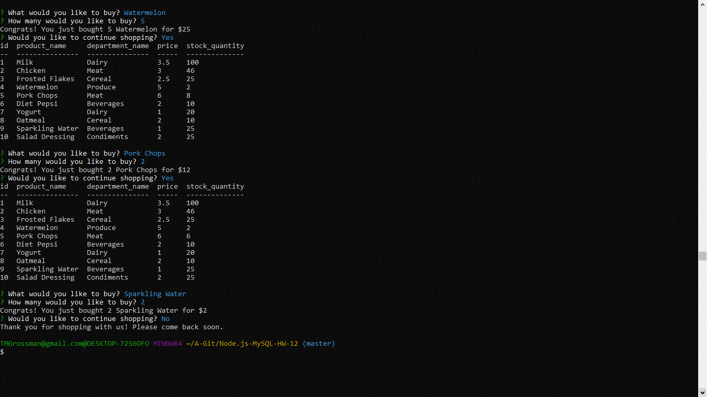

This is an Amazon-like store front application with command line Node.js with a MySQL database.  The app will take orders from customers, calculating the total cost and depleting the inventory as the customer places their orders.  It will then ask if they would like to continue shopping.  If so, it will return to the list of products to purchase.  Otherwise, it will thank them for their order. 
